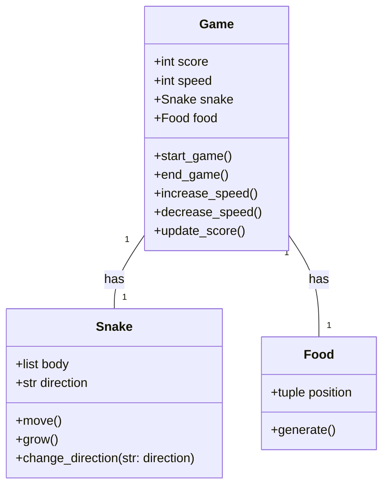
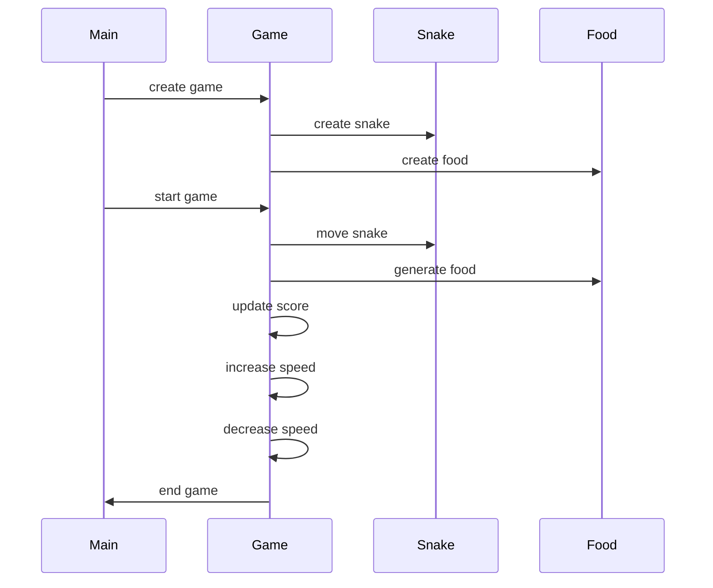

## Implementation approach
To implement this CLI Snake game, we will use Python's built-in libraries such as `curses` for the UI and `threading` for handling game speed and user input simultaneously. The game will be structured around a main `Game` class that will handle the game logic, a `Snake` class that will represent the snake, and a `Food` class for the food items. We will also use `unittest` for testing our game logic and `argparse` for handling command line arguments.

## Python package name
```python
"cli_snake_game"
```

## File list
```python
[
    "main.py",
    "game.py",
    "snake.py",
    "food.py",
    "test_game.py",
    "test_snake.py",
    "test_food.py"
]
```

## Data structures and interface definitions


## Program call flow


## Anything UNCLEAR
The requirement is clear to me.